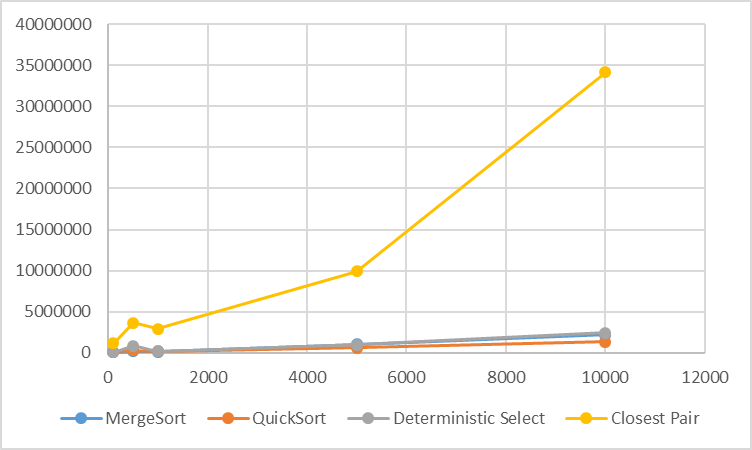
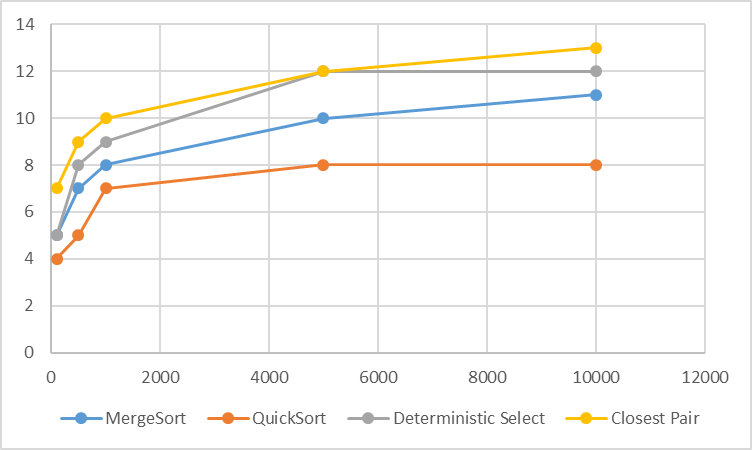

Divide-and-Conquer Algorithm Analysis
Overview

This project implements four divide-and-conquer algorithms in Java:

MergeSort

Randomized QuickSort

Deterministic Select (Median-of-Medians)

Closest Pair of Points

The project compares their theoretical complexity with experimental results. The program measures execution time, comparisons, swaps, recursive calls, and maximum recursion depth.

The results are saved in results/results.csv

Algorithms

MergeSort

MergeSort divides the array into two halves, recursively sorts them, and then merges the sorted parts.

The implementation uses a reusable auxiliary buffer and insertion sort for small arrays.

Time complexity:

О(n log n)

Recursion depth:

O(log n)

Randomized QuickSort

QuickSort selects a random pivot and uses in-place three-way partitioning.
The array is divided into elements smaller than, equal to, and greater than the pivot.
The algorithm recursively processes the smaller partition and iterates over the larger one.

Average expected complexity:
О(n log n)
Worst case:
О(n²)

Deterministic Select

Deterministic Select finds the k-th smallest element using the Median-of-Medians method.
The array is divided into groups of five. Their medians are used to choose a pivot. Only the partition containing the required element is processed recursively.

Worst-case complexity:
О(n)

Closest Pair of Points

The algorithm finds the minimum distance between two points.
The points are divided into two parts, the closest pair is found recursively in both parts, and then points near the dividing line are checked.

Time complexity:
О(n log n)

Testing

The algorithms were tested with random, sorted, reverse-sorted, duplicate-heavy, empty, and single-element arrays where applicable.
MergeSort and QuickSort were compared with Arrays.sort()
Deterministic Select was tested on 100 random cases and compared with the result of Arrays.sort()
Closest Pair was tested on 50 random cases and compared with a brute-force O(n²) solution.
All tests passed successfully.

Experiments

Experiments were performed for input sizes:

100, 500, 1000, 5000, 10000
MergeSort and QuickSort were tested with random, sorted, reverse-sorted, and duplicate-heavy arrays.
Deterministic Select was tested with random arrays using k = n / 2
Closest Pair was tested with randomly generated points
Execution time was measured using System.nanoTime()
The results were saved to results/results.csv

Results
The experiments generally matched the theoretical complexity.
MergeSort showed approximately n log n growth in comparisons and logarithmic recursion depth.
QuickSort showed good performance on random input. Three-way partitioning was especially useful for duplicate-heavy arrays.
Deterministic Select showed approximately linear growth in the number of comparisons.
Closest Pair showed approximately n log n growth in comparisons and logarithmic recursion depth.
Execution times varied between runs because of JVM warm-up, garbage collection, CPU load, and other system factors.

Plots

Execution Time vs Input Size

Recursion Depth vs Input Size

Conclusion

The project demonstrates how divide-and-conquer algorithms work and how their theoretical complexity appears in practical experiments.
The results show the expected behavior of MergeSort, Randomized QuickSort, Deterministic Select, and Closest Pair of Points
The project also demonstrates the importance of implementation details such as randomized pivots, three-way partitioning, insertion sort for small inputs, and limiting recursion to smaller partitions